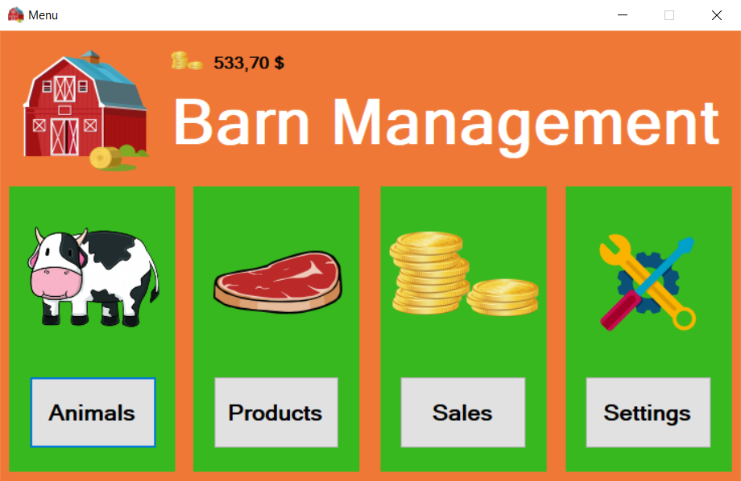
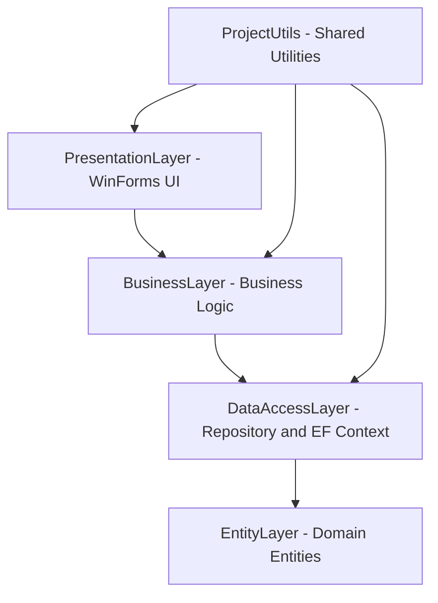
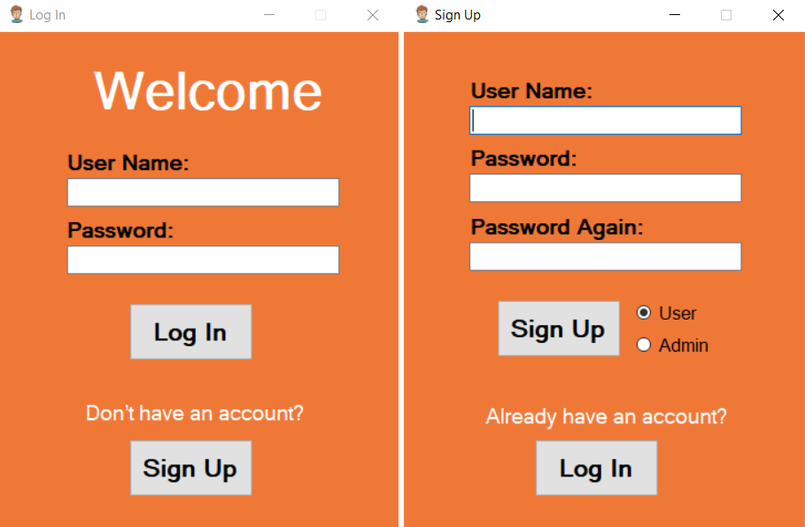
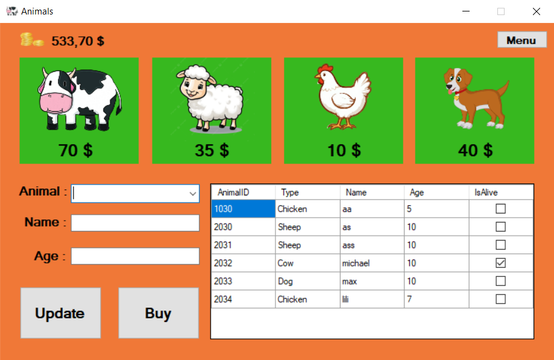
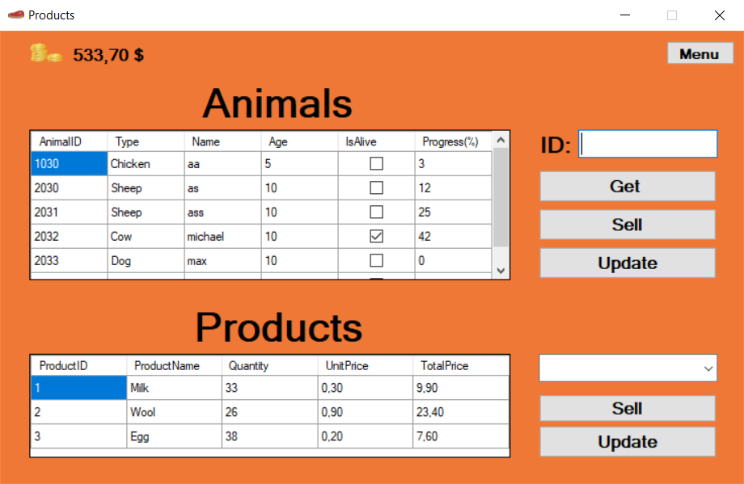
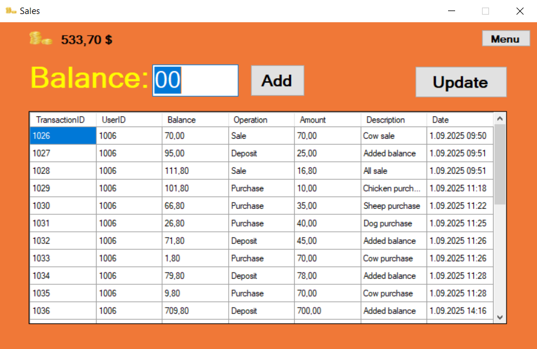
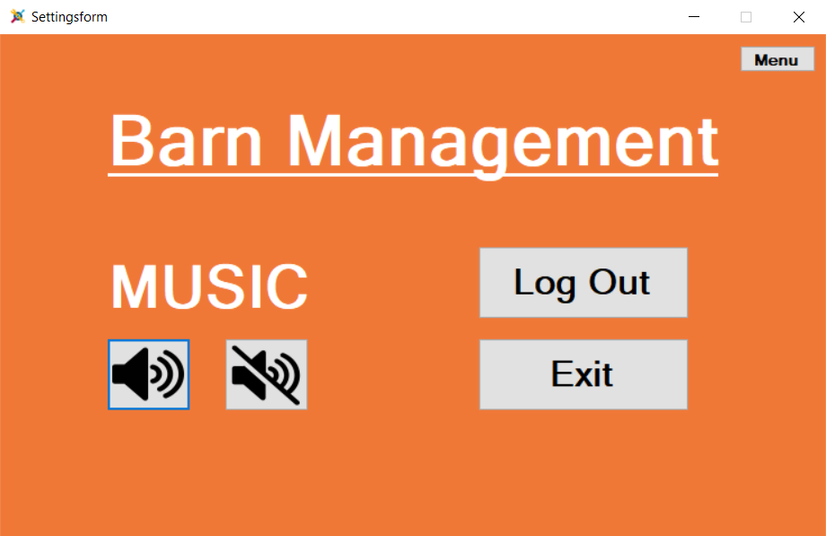

<h1 align="center">Barn Management System</h1>

<p align="center">
Barn management system built with C#, .NET Framework, WinForms, Entity Framework, and SQL Server.
</p>

<p align="center">
  
  
  
  
  
  
</p>

---

## Project Overview

Managing livestock and barn operations manually can become inefficient and error-prone as data grows.

This project provides a structured desktop application for managing core barn operations, including animal records, products, inventory, sales transactions, authentication, and centralized data storage.



---

## Features

### Authentication & Security

* User registration
* User login
* Password hashing using **BCrypt.Net**
* Global authentication/session handling

### Animal Management

* Add new animals
* Update animal records
* Delete animals
* View all registered animals

### Product & Inventory Management

* Add, edit and remove products
* Product stock tracking
* Inventory organization

### Sales & Transactions

* Record sales transactions
* Track product movements
* Transaction history support

### Settings

* User and application settings management

### Logging

* File-based logging with **Serilog**
* Error and event tracking

### Extra Feature

* Background music support using **Windows Media Player API**

---

## Technologies Used

| Category             | Technology                               |
| -------------------- | ---------------------------------------- |
| Language             | C#                                       |
| Framework            | .NET Framework 4.8                       |
| Desktop UI           | Windows Forms                            |
| ORM                  | Entity Framework 6.5.1                   |
| Database             | Microsoft SQL Server                     |
| Security             | BCrypt.Net-Next                          |
| Logging              | Serilog                                  |
| Dependency Injection | Microsoft.Extensions.DependencyInjection |
| Architecture         | Layered Architecture                     |
| Shared Utilities     | .NET Standard 2.0 class library          |

---

## Architecture

The solution follows a layered architecture that separates the user interface, business rules, data access logic, entity models, and shared utilities.



---

## Layer Responsibilities

### PresentationLayer

Contains all Windows Forms UI pages.

Forms:

* LogInForm
* SignUpForm
* AnimalForm
* ProductsForm
* SalesForm
* SettingsForm
* MainForm

### BusinessLayer

Contains business rules and service logic for animals, products, transactions, and users.

### DataAccessLayer

Responsible for database communication.

Includes:

* Generic repository operations
* Entity Framework context
* Code First migration configuration

### EntityLayer

Contains entity models:

* Animal
* Product
* Transaction
* User

### ProjectUtils

Contains shared helper and utility classes used across the solution.

---

## Project Structure

```text
Barn_Management/
|-- assets/
|   `-- screenshots/
|       |-- login-signup.png
|       |-- dashboard.png
|       |-- animals.png
|       |-- products.png
|       |-- sales.png
|       `-- settings.png
|-- BusinessLayer/
|-- DataAccessLayer/
|   |-- Abstract/
|   `-- Migrations/
|-- EntityLayer/
|   `-- Entities/
|-- PresentationLayer/
|   |-- Pages/
|   |-- Audios/
|   `-- App.config
|-- ProjectUtils/
|-- Barn_Management.sln
|-- LICENSE
`-- README.md
```

Screenshot files are stored inside `assets/screenshots` so they remain available when the project is viewed on GitHub.

---

## Database

Database provider:

`Microsoft SQL Server`

Connection string example:

```xml
Data Source=YOUR_SERVER_NAME;
Initial Catalog=BarnManagement;
Integrated Security=True
```

Uses:

* Entity Framework Code First
* Migration configuration

---

## Installation

### 1. Clone repository

```bash
git clone https://github.com/AFurkanOcel/Barn_Management.git
```

### 2. Open solution

Open:

`Barn_Management.sln`

using **Visual Studio**.

### 3. Restore NuGet packages

```powershell
Update-Package -reinstall
```

or

```powershell
nuget restore
```

### 4. Configure database

Open:

`PresentationLayer/App.config`

and update the connection string with your SQL Server instance.

### 5. Apply migrations

Open Package Manager Console:

```powershell
Update-Database
```

### 6. Run

Set **PresentationLayer** as the startup project and run the application.

---

## Screenshots

### Login / Signup



### Dashboard


### Animals



### Products



### Sales



### Settings



---

## Future Improvements

* Role-based authorization
* Reporting dashboard
* Barcode support
* Cloud synchronization
* Backup and restore support
* Modern UI redesign with WPF or .NET MAUI

---

## Learning Outcomes

This project helped improve my experience in:

* Layered architecture design
* Entity Framework
* Relational database design
* Desktop application development
* Authentication systems
* Logging systems
* Software architecture principles

---

## Author

**A. Furkan ÖCEL**

GitHub: [AFurkanOcel](https://github.com/AFurkanOcel)

---

## License

This project is licensed under the terms included in the repository's `LICENSE` file.
