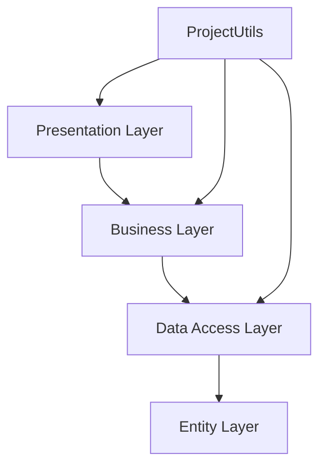

<h1 align="center">Barn Management System</h1>

<p align="center">
Desktop-based barn/farm management application built with C#, WinForms and Entity Framework.
</p>

<p align="center">
  
  
  
  
  
  
</p>

---

## Project Overview

Managing livestock and barn operations manually can become inefficient and error-prone as data grows.

This project solves that problem by providing a structured desktop application that enables:

* Animal registration and monitoring
* Product and inventory management
* Transaction recording
* Secure user authentication
* Centralized data management


---

## Project Structure

```text
Barn_Management/
│── Barn_Management.sln
│── README.md
│
├── PresentationLayer/
│   ├── MainForm.cs
│   ├── Pages/
│   │   ├── LogInForm.cs
│   │   ├── SignUpForm.cs
│   │   ├── AnimalForm.cs
│   │   ├── ProductsForm.cs
│   │   ├── SalesForm.cs
│   │   └── SettingsForm.cs
│   ├── App.config
│   └── Audios/
│       └── Music.mp3
│
├── BusinessLayer/
│   └── Business logic services
│
├── DataAccessLayer/
│   ├── Abstract/
│   ├── Migrations/
│   └── Entity Framework repositories
│
├── EntityLayer/
│   └── Entities/
│       ├── User.cs
│       ├── Animal.cs
│       ├── Product.cs
│       └── Transaction.cs
│
└── ProjectUtils/
    └── Shared helper utilities
```

---

## Features

### Authentication & Security

* User registration
* User login
* Password hashing using **BCrypt**
* Global authentication/session handling

### Animal Management

* Add new animals
* Update animal records
* Delete animals
* View all registered animals

### Product Management

* Add, edit and remove products
* Product stock tracking
* Inventory organization

### Sales & Transactions

* Record sales transactions
* Track product movements
* Transaction history support

### Settings

* User and application settings management

### Logging

* File-based logging with **Serilog**
* Error and event tracking

### Extra Feature

* Background music support using **Windows Media Player API**

---

## Technologies Used

| Category             | Technology                               |
| -------------------- | ---------------------------------------- |
| Language             | C#                                       |
| Framework            | .NET Framework 4.8                       |
| UI                   | Windows Forms                            |
| ORM                  | Entity Framework 6.5.1                   |
| Database             | Microsoft SQL Server                     |
| Security             | BCrypt.Net                               |
| Logging              | Serilog                                  |
| Dependency Injection | Microsoft.Extensions.DependencyInjection |
| Architecture         | Layered Architecture                     |

---

## Architecture

This project follows a **5-layer architecture**:



---

## Layer Responsibilities

### PresentationLayer

Contains all Windows Forms UI pages.

Forms:

* LoginForm
* SignUpForm
* AnimalForm
* ProductsForm
* SalesForm
* SettingsForm
* MainForm

### BusinessLayer

Contains business rules and service logic.

### DataAccessLayer

Responsible for database communication.

Includes:

* Repository operations
* Entity Framework context
* Code First Migrations

### EntityLayer

Contains entity models:

* Animal
* Product
* Transaction
* User

### ProjectUtils

Shared helper and utility classes.

---

## Database

Database provider:

`Microsoft SQL Server`

Connection string example:

```xml
Data Source=YOUR_SERVER_NAME;
Initial Catalog=BarnManagement;
Integrated Security=True
```

Uses:

* Entity Framework Code First
* Migration Configuration

---

## Installation

### 1. Clone repository

```bash
git clone https://github.com/AFurkanOcel/Barn_Management.git
```

### 2. Open solution

Open:

`Barn_Management.sln`

using **Visual Studio**.

### 3. Restore NuGet packages

```powershell
Update-Package -reinstall
```

or

```powershell
nuget restore
```

### 4. Configure database

Open:

`PresentationLayer/App.config`

and update the connection string with your SQL Server instance.

### 5. Apply migrations

Open Package Manager Console:

```powershell
Update-Database
```

### 6. Run

Set **PresentationLayer** as startup project and run.

---

## Screenshots

### Login - Signup


### Animals


### Products


### Sales


### Settings


---

## Future Improvements

* Role-based authorization
* Reporting dashboard
* Barcode support
* Cloud synchronization
* Backup and restore support
* Modern UI redesign (WPF / MAUI)

---

## Learning Outcomes

This project helped improve my experience in:

* Layered architecture design
* Entity Framework
* Relational database design
* Desktop application development
* Authentication systems
* Logging systems
* Software architecture principles

---

## Author

**A. Furkan ÖCEL**
